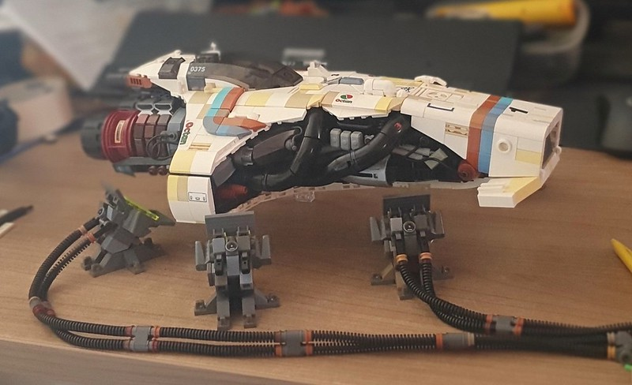

# Redock - Recreate docker container with updated image

## Description

Script/binary file able to recreate existing container with same settings as it had before

- ensure that new container indeed does have all the old settings. As i will be using it, hopefully all corner cases will be validated

The point of this script to implement smooth CI CD for single container applications.

- You build in CI like Github actions your docker image and push into docker registry
- `curl -L $(curl -Ls -o /dev/null -w %{url_effective} https://github.com/darklab8/redock/releases/latest | sed "s/releases\/tag/releases\/download/")/redock-linux-amd64 -o /usr/local/bin/redock && chmod 777 /usr/local/bin/redock`
- `DOCKER_HOST=“ssh://user@remotehost” redock --ctr=${CONTAINER_ID_OR_NAME} --strict_pull=true`

That's it. there `redock` script for you will try to repull the image name of a container, and stop old one and start new container with exactly same settings. Thus you will have container running with the same settings. This approach is good if u wish keeping other docker container running configurations (Envs/volumes and etc) independenly (like me controlling docker configuration with [Docker Terraform provider](https://registry.terraform.io/providers/kreuzwerker/docker/latest/docs) for pet projects at least)

## Example of usage:

See [Github actions workflow file](./.github/build.yml) for steps from `Test setup` to `Redock run`
- Add to it DOCKER_HOST=“ssh://user@remotehost” and it will be usable for automated CD without knowing app container configuration
